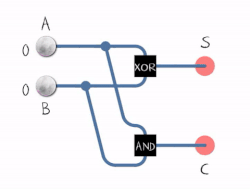
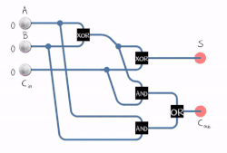
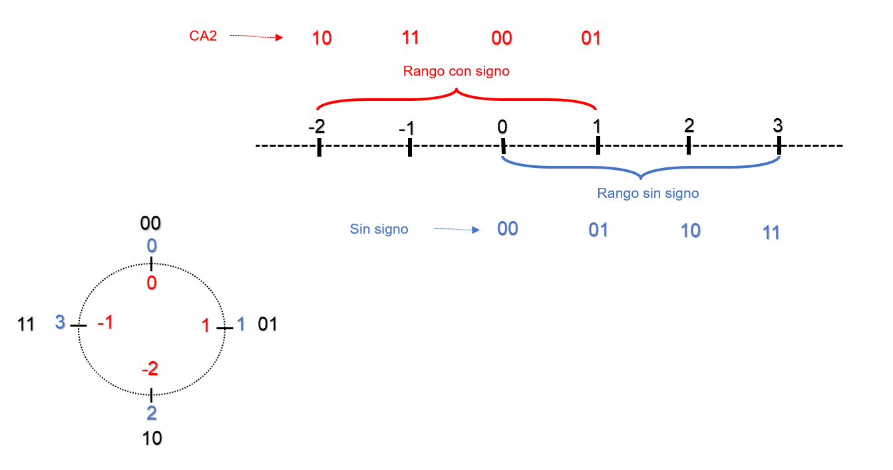
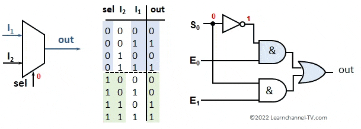
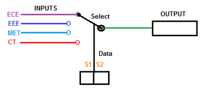

## Sumador
El sumador es un circuito digital que realiza la adición de números.

### Semisumador
El semisumador suma dos dígitos binarios simples A y B, denominados sumandos, y sus salidas son Suma (S) y Acarreo (C).

| A | B | **C** | **S** |
|---|---|-------|-------|
| 0 | 0 | **0** | **0** |
| 0 | 1 | **0** | **1** |
| 1 | 0 | **0** | **1** |
| 1 | 1 | **1** | **0** |

<iframe src="https://circuitverse.org/simulator/embed/circuitos-combinacionales-a40f2bd0-0210-4c0b-b762-224537d03e91?theme=default&display_title=false&clock_time=false&fullscreen=true&zoom_in_out=true" style="border-width:; border-style: solid; border-color:;" name="myiframe" id="projectPreview" scrolling="no" frameborder="1" marginheight="0px" marginwidth="0px" height="500" width="500" allowFullScreen></iframe>

### Sumador completo
Un sumador completo suma números binarios junto con las cantidades de acarreo.

<iframe src="https://circuitverse.org/simulator/embed/circuitos-combinacionales-sumador-completo?theme=default&display_title=false&clock_time=false&fullscreen=true&zoom_in_out=true" style="border-width:; border-style: solid; border-color:;" name="myiframe" id="projectPreview" scrolling="no" frameborder="1" marginheight="0px" marginwidth="0px" height="500" width="500" allowFullScreen></iframe>

### Sumador de dos bits
Un sumador con propagación de acarreo, también denominado sumador de acarreo serie, es aquel constituido por varios sumadores completos en los cuales el acarreo de salida se conecta a la entrada de acarreo del sumador siguiente.

<iframe src="https://circuitverse.org/simulator/embed/circuitos-combinacionales-b008f362-4fbc-4b2a-84e7-91f87b3b6ec1?theme=default&display_title=false&clock_time=false&fullscreen=true&zoom_in_out=true" style="border-width:; border-style: solid; border-color:;" name="myiframe" id="projectPreview" scrolling="no" frameborder="1" marginheight="0px" marginwidth="0px" height="500" width="500" allowFullScreen></iframe>

### Sumador-restador de dos bits
#### Complemento A2
Para realizar la operación aritmética restar la computadora lo implementa sumando, donde el sustraendo se expresa en complemento A2, es decir, en su equivalente negativo :

 `A – B = A + (-B)`

Para calcular el complemento A2 de B se deben invertir los bits (puerta NOT lógico) y sumar el valor 1, para que el circuito realice eso se ingresa el valor 1 en el primer Acarreo-in del sumador. Luego se realiza la operación sumar tradicional.

| Binario | sin sign | con signo (CA2)    |
| - |--------|----------------------|
| 11 | 3    | -1 | 
| 10 | 2    | -2  | 
| 01 | 1    | +1  | 
| 00 | 0    |  0  | 

<iframe src="https://circuitverse.org/simulator/embed/sumador-restador-de2-bits-circuitos-combinacionales?theme=default&display_title=false&clock_time=false&fullscreen=true&zoom_in_out=true" style="border-width:; border-style: solid; border-color:;" name="myiframe" id="projectPreview" scrolling="no" frameborder="1" marginheight="0px" marginwidth="0px" height="500" width="500" allowFullScreen></iframe>

 [fuente: Wiki](https://es.wikipedia.org/wiki/Sumador)

## Multiplexor
Un multiplexor (MUX) es un conmutador digital que conecta datos de una de n fuentes a la salida. Están dotados de entradas de control capaces de seleccionar una, y solo una, de las entradas de datos para permitir su transmisión desde la entrada seleccionada hacia dicha salida.[fuente: Wiki](https://es.wikipedia.org/wiki/Multiplexor)

[Fuente](https://learnchannel-tv.com/en/digital-electronics/multiplexing-function/)

<iframe src="https://circuitverse.org/simulator/embed/multiplexor-circuitos-combinacionales?theme=default&display_title=false&clock_time=false&fullscreen=true&zoom_in_out=true" style="border-width:; border-style: solid; border-color:;" name="myiframe" id="projectPreview" scrolling="no" frameborder="1" marginheight="0px" marginwidth="0px" height="500" width="500" allowFullScreen></iframe>

### Multiplexor de 4 entradas 
Un multiplexor de 4 entradas tiene un control selector (C) de 2 bits y se puede construir con 3 multiplexores de 2 entradas.

[Fuente](https://www.androiderode.com/multiplexer-and-demultiplexer-animation/)

<iframe src="https://circuitverse.org/simulator/embed/multiplexor-4-entradas-circuitos-combinacionales?theme=default&display_title=false&clock_time=false&fullscreen=true&zoom_in_out=true" style="border-width:; border-style: solid; border-color:;" name="myiframe" id="projectPreview" scrolling="no" frameborder="1" marginheight="0px" marginwidth="0px" height="500" width="500" allowFullScreen></iframe>

## Decodificador
Un decodificador convierte un código binario de N bits de entrada y M líneas de salida, tales que cada línea de salida será activada para una sola de las combinaciones posibles de entrada.
[fuente: Wiki](https://es.wikipedia.org/wiki/Decodificador#:~:text=Un%20decodificador%20es%20un%20circuito,ser%C3%A1%20activada%20para%20una%20sola)

<iframe src="https://circuitverse.org/simulator/embed/decodificador-circuitos-combinacionales?theme=default&display_title=false&clock_time=false&fullscreen=true&zoom_in_out=true" style="border-width:; border-style: solid; border-color:;" name="myiframe" id="projectPreview" scrolling="no" frameborder="1" marginheight="0px" marginwidth="0px" height="500" width="500" allowFullScreen></iframe>

[Circuitos combinacionales en logisim](https://drive.google.com/drive/folders/1lCuW1E56DdzXhiComBH8T8VFIfGi-37w?usp=drive_link)
