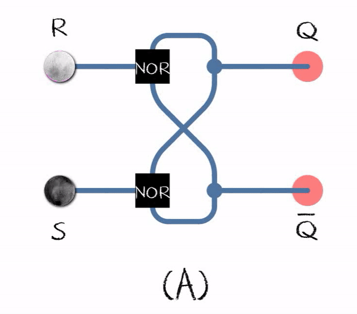
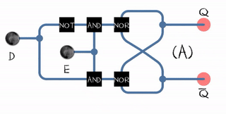

La importancia de los circuitos lógicos se debe a su característica de memoria.

## Retroalimentación
Es un mecanismo por el cual una cierta proporción de la salida de un sistema se redirige a la entrada. 
[Fuente wikipedia](https://es.wikipedia.org/wiki/Realimentaci%C3%B3n)

<iframe src="https://circuitverse.org/simulator/embed/retroalimentacion?theme=default&display_title=false&clock_time=false&fullscreen=true&zoom_in_out=true" style="border-width:; border-style: solid; border-color:;" name="myiframe" id="projectPreview" scrolling="no" frameborder="1" marginheight="0px" marginwidth="0px" height="500" width="500" allowFullScreen></iframe>

## Biestable
Es un circuito que tiene dos estados estables y puede usarse para almacenar información.

### RS ("reset-set")
El RS tiene dos entradas R (reset) y S (set) y dos salidas complementarias Q.

<iframe src="https://circuitverse.org/simulator/embed/biestable-rs-circuitos-secuenciales?theme=default&display_title=false&clock_time=false&fullscreen=true&zoom_in_out=true" style="border-width:; border-style: solid; border-color:;" name="myiframe" id="projectPreview" scrolling="no" frameborder="1" marginheight="0px" marginwidth="0px" height="500" width="500" allowFullScreen></iframe>

### RS ("reset-set") con puertas NOR
Para producir registros a gran escala se utilizan puertas NAND o NOR, pero sin perder su objetivo principal de memoria, además agregan una salida complementada Q’ que ofrece mayor flexibilidad para múltiples usos. Entonces, el RS con puertas NOR tiene dos entradas R (reset) y S (set) y dos salidas complementarias Q y Q complemento (Q').	

<iframe src="https://circuitverse.org/simulator/embed/biestable-rs-con-nor-circuitos-secuenciales?theme=default&display_title=false&clock_time=false&fullscreen=true&zoom_in_out=true" style="border-width:; border-style: solid; border-color:;" name="myiframe" id="projectPreview" scrolling="no" frameborder="1" marginheight="0px" marginwidth="0px" height="500" width="500" allowFullScreen></iframe>

[Fuente wikipedia](https://en.wikipedia.org/wiki/Flip-flop_%28electronics%29)

:::caution[Problema de indeterminación]
Se produce una indeterminación, debido a que la salida Q=Q’=cero y si el próximo valor de Set = 0 y Reset = 0 entonces el valor de la salida es incierta, es decir, no se puede conocer si será cero o uno. 
:::

### D ("Data")
El biestable D tiene una sola entrada D (Data), los datos proporcionados en la entrada pasarán a la salida sólo si la señal del reloj es alta. 

<iframe src="https://circuitverse.org/simulator/embed/biestable-data-circuitos-secuenciales?theme=default&display_title=false&clock_time=true&fullscreen=true&zoom_in_out=true" style="border-width:; border-style: solid; border-color:;" name="myiframe" id="projectPreview" scrolling="no" frameborder="1" marginheight="0px" marginwidth="0px" height="500" width="500" allowFullScreen></iframe>

:::tip[Solución a la indeterminación]
Para evitar la indeterminación del registro se unen ambas entradas Set y Reset más una puerta lógica NOT y se construye el registro D (Data). 
:::

### D ("Data") con Clock (reloj)
Al biestable D se le incorpora una entrada C (Clock).

<iframe src="https://circuitverse.org/simulator/embed/biestable-d-con-clock-circuitos-secuenciales?theme=default&display_title=false&clock_time=false&fullscreen=true&zoom_in_out=true" style="border-width:; border-style: solid; border-color:;" name="myiframe" id="projectPreview" scrolling="no" frameborder="1" marginheight="0px" marginwidth="0px" height="500" width="500" allowFullScreen></iframe>

:::note[Señal de Clock]
El valor ingresado por Data se almacena en Q cuando la entrada Clock es igual a uno, si Clock es cero no se producen cambios en Q.
:::

### D ("Data") con habiliación (Enable)
Al biestable D se le incorpora una entrada de habilitación E (Enable), esto permite que solo se escriba o actualice el dato del registro cuando esta entrada esta en 1.

<iframe src="https://circuitverse.org/simulator/embed/biestable-d-con-habilitacion-enable-circuitos-secuenciales?theme=default&display_title=false&clock_time=false&fullscreen=true&zoom_in_out=true" style="border-width:; border-style: solid; border-color:;" name="myiframe" id="projectPreview" scrolling="no" frameborder="1" marginheight="0px" marginwidth="0px" height="500" width="500" allowFullScreen></iframe>

### D ("Data") con activación por flanco de subida
Al biestable D con activación por flanco de subida.
<iframe src="https://circuitverse.org/simulator/embed/biestable-d-activado-por-flanco-de-subida-circuitos-secuenciales?theme=default&display_title=false&clock_time=false&fullscreen=true&zoom_in_out=true" style="border-width:; border-style: solid; border-color:;" name="myiframe" id="projectPreview" scrolling="no" frameborder="1" marginheight="0px" marginwidth="0px" height="500" width="500" allowFullScreen></iframe>

[Circuitos secuenciales en logisim](https://drive.google.com/drive/folders/1lCuW1E56DdzXhiComBH8T8VFIfGi-37w?usp=drive_link)