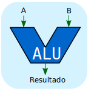

Previo análisis de la máquina Sim-AC será necesario introducir las siguientes definiciones que son de vital importancia para comprender el funcionamiento de una computadora:

### Componentes básicos de una computadora      
- **Procesador o unidad central de proceso (CPU)**: está compuesto por:
      

  - **Unidad Aritmetica y logica (ALU)**: es la unidad encargada de realizar las operaciones elementales de tipo aritmético (sumas y restas) y de tipo lógico (AND, OR, etc.).
      

  - **Registro**: en general se los identifica como una “memoria muy rápida” que permite almacenar una cierta cantidad de bits (información).
    

    Al juntarse con la ALU quedaría:

    
  
  - **Unidad de control (UC)**: desde ella se controlan y gobiernan todas las operaciones (búsqueda y ejecución de instrucciones) de la CPU. Es la encargada de extraer de la memoria principal la nueva instrucción a ejecutar, analizarla y extraer también los operandos implicados. A su vez, desencadena el tratamiento de los datos en la ALU y, de ser necesario, los almacena en la memoria principal.
    

- **Memoria**: se encuentra dividida en celdas o posiciones de memoria cuyo contenido es variable y son identificadas por un número fijo llamado dirección de memoria. La capacidad total de una memoria está dada por la cantidad de celdas disponibles, en ella se almacenan dos clases de información: las instrucciones del programa que se deberá ejecutar y los datos (comúnmente llamados operandos) con los cuales deberá trabajar el programa. El CPU se comunica con la Memoria principal mediante los buses de direcciones, datos y de control. 

  

- **Buses**: proporciona un medio de transporte de información entre las distintas partes de la computadora, no almacena información sólo la transmite. Compuesto por tres tipos de buses:
  - Direcciones (linea azul)
  - Datos (linea verde)
  - Control (linea roja)

- **Modulo de entrada/salida**: gestiona la trasferencia de un conjunto de informaciones entre las unidades periféricas y el CPU, tanto en un sentido como en otro.

En resumen, se puede representar un computadora como un conjunto ensamblado de unidades diferentes, cuyo funcionamiento viene dictado por el programa almacenado en la memoria principal. La unidad de control gobierna la ejecución de las operaciones pedidas por dicho programa. Si la operación es un cálculo, es la unidad aritmético-lógica quien lo realiza, si es una transferencia de informaciones con el exterior se cede el control a un modulo de E/S.

