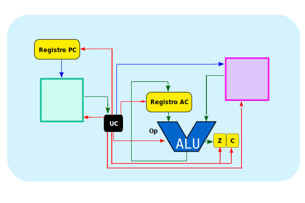
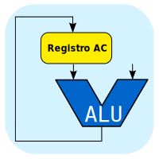

El diseño del CPU Sim-AC es intuitiva y fácil, los dividiremos en partes que representan las decisiones arquitectónicas que se tomaron para su contrucción:

  

:::caution[Simplificaciones]
Este simulador busca ser una herramienta para la enseñanza de la arquitectura de computadoras, introduciendo una arquitectura lo más simple posible.
:::

## ALU:
  La operaciones de la ALU siempre tiene como destino el registro AC y realiza operaciones con datos de de 1 byte (8 bits)

  
  
## Registros:
  - Registro acumulador (AC) de 8 bits (1 byte);
  - Dos registros banderas (Flags) de 1 bit, uno denominados acarreo (Carry) y cero (Zero)
  - Registro contador de programa (PC) de 5 bits; 

## Arquitectura harvard
Dentro de los procesadoes actuales, por una cuestion de simplicidad y eficiencia se dividen los programas en dos memorias separadas una para datos y otra para código. Este diseño se denomina [arquitectura harvard](https://es.wikipedia.org/wiki/Arquitectura_Harvard#:~:text=La%20arquitectura%20de%20Harvard%20es,instrucciones%20y%20para%20los%20datos)
  

### Memoria de instrucciones y de datos:
  Las memorias son de 32 bytes y cada una contiene un 8 bits (1 byte), por lo tanto es posible acceder a 32 posiciones (2**5 = 32) ya que el PC es de 5 bits.

## Sim-AC Harvard en Circuitverse(on-line)
<iframe src="https://circuitverse.org/simulator/embed/8-carga-inmediata-ldi-sim-ac-harvard?theme=default&display_title=false&clock_time=false&fullscreen=true&zoom_in_out=true" style="border-width:; border-style: solid; border-color:;" name="myiframe" id="projectPreview" scrolling="no" frameborder="1" marginheight="0px" marginwidth="0px" height="500" width="500" allowFullScreen></iframe>

:::tip[Míralo en acción]
Para poder verlo mejor es necesario presionar sobre pantalla completa
:::

