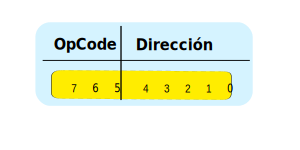

Antes de introducir la instrucción de carga de memoria (LDA) es necesario desarrollar los siguientes conceptos: 

## Formato de instrucciones
Todas las instrucciones son de 1 byte (8 bits) y tienen el siguiente formato:

  

- **Código de operación (OpCode)**: de 3 bits representado por los bits 7 al 5. 
- **Dirección**: desde los bits 4 al 0 representan el contenido de la dirección de memoria para la mayoria de las instrucciones.

## Nemónico
Para identificar a cada instrucción se la asigna un nombre, denominado nemónico de 3 o 2 letras:

| # | OpCode | Nemonico             | Acción
| - |--------|----------------------|------------
| 0 | 000    | **ADD** [Dirección]  | Sumar el registro AC con el contenido de memoria xxx
| 1 | 001    | **SUB** [Dirección]  | Restar el registro AC con el contenido de memoria xxx
| 2 | 010    | **LDA** [Dirección]  | Cargar el contenido de la dirección de memoria xxx en el registro AC

<iframe src="https://circuitverse.org/simulator/embed/ac-2-cargar-de-memoria-sim-ac-harvard-d9f356de-6946-4504-8814-7c42e2f76dd0?theme=default&display_title=false&clock_time=false&fullscreen=true&zoom_in_out=true" style="border-width:; border-style: solid; border-color:;" name="myiframe" id="projectPreview" scrolling="no" frameborder="1" marginheight="0px" marginwidth="0px" height="500" width="500" allowFullScreen></iframe>

  