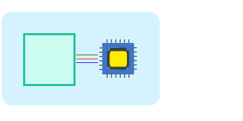
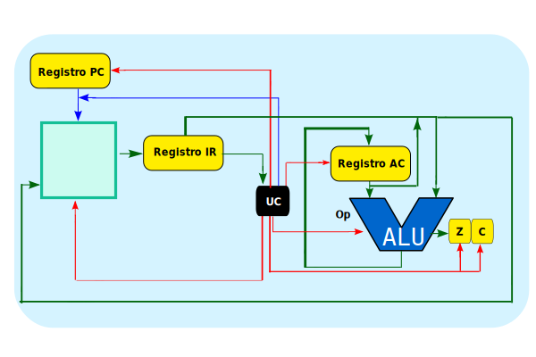

## Idea
Hasta mediados de los años cuarenta, los computadores se programaban mediante la manipulación de un panel frontal, donde los usuarios conectaban o desconectaban switches (conmutadores) para que el computador realizara diferentes funciones y completara la tarea deseada. A finales de 1945, Von Neumann publicó un artículo que marcó un paso decisivo hacia la automatización del procesamiento digital de la información, introduciendo dos conceptos innovadores:

- **El programa almacenado**: el computador tendría un conjunto de instrucciones almacenado en su propia memoria. En lugar de ejecutar las operaciones conforme a su lectura directa desde un medio externo (como una cinta perforada), la nueva máquina almacena el programa en la memoria antes de ejecutar las operaciones. La memoria se utiliza tanto para almacenar datos como instrucciones del programa. Esta idea, aparentemente sencilla, ha prevalecido en el diseño de los computadores hasta nuestros días.

- **La ruptura de Secuencia**: este concepto es fundamental para la capacidad de toma de decisiones de los programas. En lugar de requerir intervención humana cada vez que se presenta una decisión (ligada estrechamente a los resultados obtenidos), las operaciones de decisión lógica son automáticas, permitiendo a la máquina usar una instrucción llamada salto condicional o ruptura condicional de secuencia. Dependiendo del valor de un resultado previo, la máquina ejecutará una u otra parte del programa.

## Memoria Unificada de Datos e Instrucciones
La arquitectura de Von Neumann se caracteriza también por la unificación de la memoria para datos e instrucciones. Esto significa que tanto los datos del programa como las instrucciones que el CPU debe ejecutar se almacenan en el mismo espacio de memoria.

  

## Registro de Instrucciones
Para gestionar eficientemente esta arquitectura, se implementa un registro de instrucciones, que almacena temporalmente la instrucción mientras se obtiene el operando necesario.

## Ciclo Fetch-Execute
Para ejecutar una instrucción, el CPU sigue un ciclo básico de dos fases: fetch y execute. En la fase de fetch, el CPU recupera (fetches) la instrucción desde la memoria y la almacena temporalmente en el registro de instrucciones. En la fase de execute, el CPU procesa la instrucción recuperada, llevando a cabo la operación indicada, que puede implicar cálculos, movimiento de datos o alteración de la secuencia de ejecución del programa. Este ciclo de fetch-execute se repite continuamente mientras el computador esté en funcionamiento, permitiendo la ejecución secuencial y eficiente de las instrucciones del programa almacenado.

  

<iframe src="https://circuitverse.org/simulator/embed/8-carga-inmediata-ldi-sim-ac-neumann?theme=default&display_title=false&clock_time=false&fullscreen=true&zoom_in_out=true" style="border-width:; border-style: solid; border-color:;" name="myiframe" id="projectPreview" scrolling="no" frameborder="1" marginheight="0px" marginwidth="0px" height="500" width="500" allowFullScreen></iframe>

(Mantiene el mismo [Repertorio de instrucciones](../../../parte-2-disenio-cpu/sim-ac-harvard/8-ldi/))