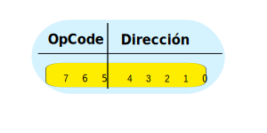

  

- **Código de operación (OpCode)**: de 3 bits representado por los bits 7 al 5. 
- **Dirección**: desde los bits 4 al 0 representan la dirección y se puede interpretar de dos maneras:
  - si la dirección esta entre corchetes [Dirección], representa el contenido de la dirección de memoria,
  - sin embargo, si la dirección no tiene corchetes representa la dirección de memoria no su contenido, esto es muy util para indicar el destino de una instrucción de salto. 

<iframe src="https://circuitverse.org/simulator/embed/5-salto-incondiconal-jmp-sim-ac-harvard?theme=default&display_title=false&clock_time=false&fullscreen=true&zoom_in_out=true" style="border-width:; border-style: solid; border-color:;" name="myiframe" id="projectPreview" scrolling="no" frameborder="1" marginheight="0px" marginwidth="0px" height="500" width="500" allowFullScreen></iframe>
